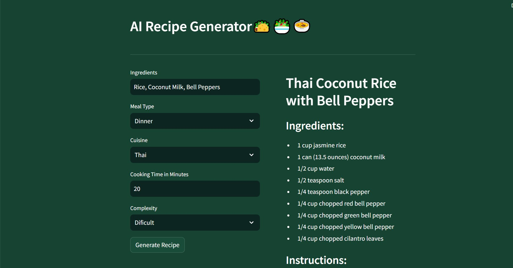

# AI Recipe Generator: Crafting Culinary Creations with Google's Generative AI Text-Bison Model

The AI Recipe Generator project aims to revolutionize the culinary world by leveraging the power of Artificial Intelligence to create personalized recipes tailored to individual preferences. By utilizing Google's cutting-edge Generative AI text-bison model, this project will provide users with an innovative platform to generate recipes based on specified ingredients, meal type, cuisine, cooking time, and complexity level.

## Features

1. Ingredient-Based Recipe Generation: Users can input their preferred ingredients, allowing the AI to generate creative and delicious recipes that incorporate those ingredients.

2. Meal Type Selection: Whether it's breakfast, lunch, dinner, or snacks, users can specify the type of meal they're interested in, ensuring that the generated recipes suit their needs and preferences.

3. Cuisine Customization: From Italian to Thai, users can select their desired cuisine to explore recipes that align with their culinary preferences and cultural tastes.

4. Cooking Time Adjustment: Users can indicate their available cooking time, enabling the AI to generate recipes that fit within their schedule, whether they have a few minutes or several hours to spare.

5. Complexity Level Setting: Whether users are beginners or experienced chefs, they can choose the complexity level of the recipes, ranging from simple and quick dishes to more intricate culinary creations.

6. User-Friendly Interface: The platform will feature an intuitive and user-friendly interface, allowing users to easily input their preferences and explore generated recipes effortlessly.

7. Recipe Variations: The AI will offer multiple recipe variations based on the provided inputs, giving users a diverse range of options to choose from.

## Environment Variables

To run this project, you will need to add the following environment variables to your .env file

`GOOGLE API KEY`

## Screenshots

